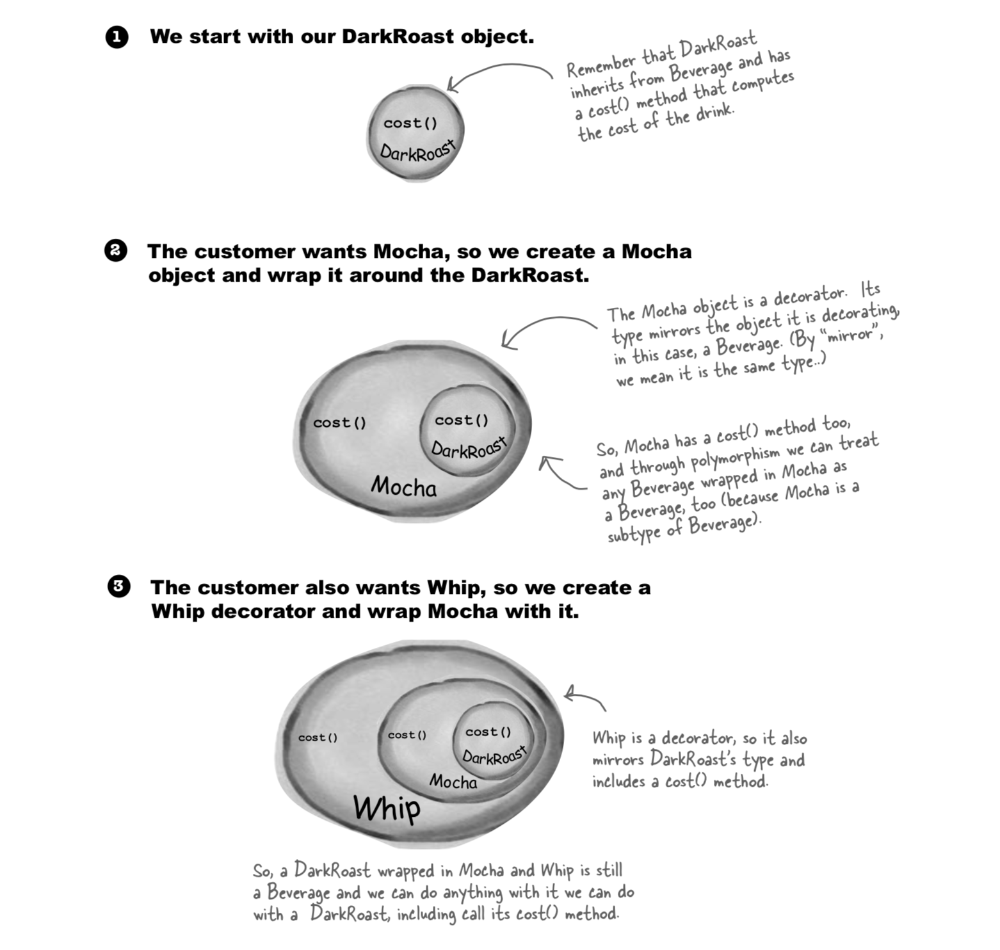

# Decorator Pattern

The textbook definition for Decorator Pattern is

**Decorator Pattern**: attaches additional responsibilities to an object dynamically. Decorators provide a flexible alternative to subclassing for extending functionality.

For the Decorator Pattern, we will be utilizing the *Design Principle*: Classes should be open for extension, but closed for modification.

**Our goal** is to allow classes to be easily extended to incorporate new behavior without modifying existing code. What do we get if we accomplish this?

In the example, we will be decorating a beverage with condiments.

So if the customer wants **Dark Roast** with *Mocha* and *Whip*.

Here are the steps

1. Take the Dark Roast object
2. Decorate it with the Mocha Object
3. Decorate it with a Whip Object
4. Call the cost() method and rely on delegation to add on the condiment costs

Here's a visual to help you understand.



## Build & Run Instructions

To build the program, go inside the DecoratorPattern directory.

Install dependencies

```
yarn install
```

Build typescript

```
yarn run build
```

Run command to start

```
yarn run start
```
