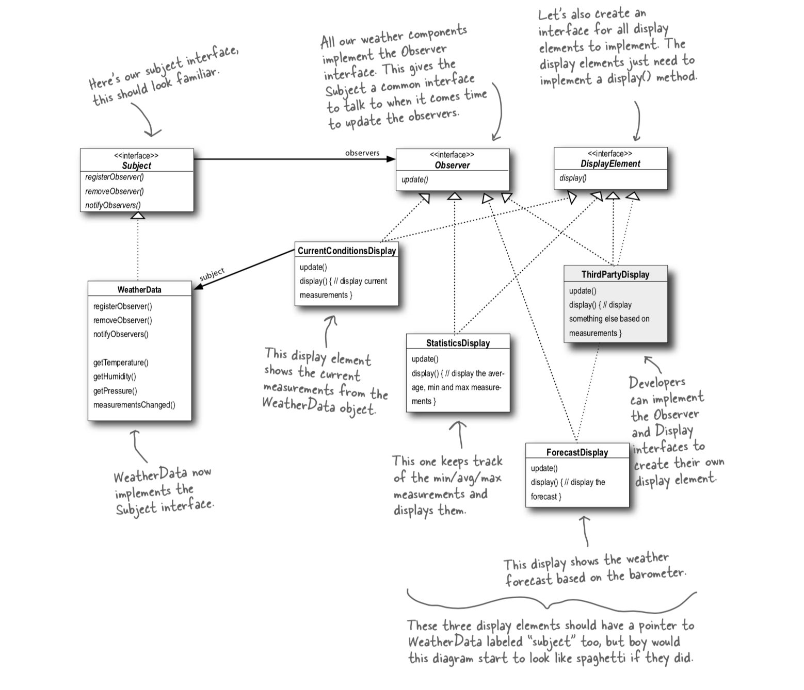

# Observer Pattern

So the textbook definition of the Observer Pattern is

**Observer Pattern**: defines a one-to-many dependecy between objects so that when one object changes state, all of its dependents are notified and updated automatically

The subject and observers define a one-to-many relationshp. Observers are dependent  on the subject such that when the subject's state changes, observers are notified. Here is the UML diagram of our program



In this program, the WeatherData object updates CurrentConditionsDisplay which results in a print statement that states the temperature and humidity upon receiving an update from the observer.

## Build & Run Instructions

To build the program, go inside the DecoratorPattern directory.

Install dependencies

```
yarn install
```

Build typescript

```
yarn run build
```

Run command to start

```
yarn run start
```
